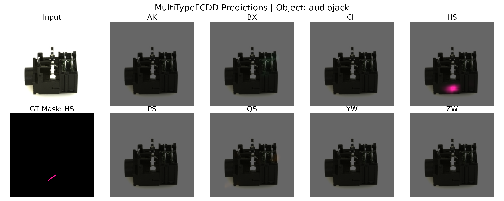

# PyTorch implementation of MultiTypeFCDD

This repository provides demo code for **MultiTypeFCDD**, including training and testing the model, producing anomaly heatmaps for multi-type anomaly detection.
We experiment on the Real-IAD dataset, which contains **30 object categories** and **8 anomaly types**.

For this demo, we follow the **default settings used in the paper**. Specifically, we employ an **Inception-ResNet-v2** backbone trained on the ImageNet database with an input size of **299×299**, using only the first three downsampling stages of the encoder. All backbone layers are kept **frozen** to retain the generic ImageNet-trained feature representations.

Attached to this encoder is a lightweight **convolutional head** consisting of:

1. **Two convolutional blocks**  
   - Each block: `3×3` convolution with **512 filters**  
   - Followed by **Batch Normalisation**  
   - And a **ReLU** activation
<!-- spacer -->
2. A **1×1 convolution layer**  
   - Number of output channels = **number of anomaly types**
<!-- spacer -->
3. A **differentiable pseudo-Huber loss function layer**  
   - Applied independently to each anomaly channel


---

## 1. Object Categories

The dataset contains the following object categories:

<table>
  <tr><td>audiojack</td><td>bottle_cap</td><td>button_battery</td><td>end_cap</td><td>eraser</td><td>fire_hood</td></tr>
  <tr><td>mint</td><td>mounts</td><td>pcb</td><td>phone_battery</td><td>plastic_nut</td><td>plastic_plug</td></tr>
  <tr><td>porcelain_doll</td><td>regulator</td><td>rolled_strip_base</td><td>sim_card_set</td><td>switch</td><td>tape</td></tr>
  <tr><td>terminalblock</td><td>toothbrush</td><td>toy</td><td>toy_brick</td><td>transistor1</td><td>u_block</td></tr>
  <tr><td>usb</td><td>usb_adaptor</td><td>vcpill</td><td>wooden_beads</td><td>woodstick</td><td>zipper</td></tr>
</table>

---

## 2. Defect Codes

The Real-IAD dataset labels anomalies using the following codes:

| Code | Description         |
|------|-------------------|
| AK   | Pit                |
| BX   | Deformation        |
| CH   | Abrasion           |
| HS   | Scratch            |
| PS   | Damage             |
| QS   | Missing Parts      |
| YW   | Foreign Objects    |
| ZW   | Contamination      |
| OK   | Normal (no anomaly)|

---

## 3. Dataset Preparation

Download the **Real-IAD dataset** and its associated JSON metadata files.  

- Use the **realiad_256** downsampled version (256×256).  
- The folder structure should look like this:


        MultiTypeFCDD
        ├── dataset
        │   ├── audiojack
        │   ├── bottle_cap
        │   ├── button_battery
        │     ⋮
        ├── realiad_jsons
        │   ├── realiad_jsons_fuiad_0.1
        │   ├── realiad_jsons_fuiad_0.2
        │   ├── realiad_jsons_fuiad_0.4
        │     ⋮
        ├── config.py                
        ├── dataset.py               
        ├── model.py                 
        ├── loss.py                  
        ├── verify_dataset.py  
        ├── check_model.py           
        ├── train.py                 
        ├── evaluate.py
        ├── list_indices.py          
        ├── visualize_anomalies.py
        ├── readme.md
        └── requirements.txt

---

## 4. Configuration Options

All global parameters, dataset paths, and file selections are centralized inside `config.py`. Inside the script, the selection of the `ALPHA` parameter $(\alpha \in \{0.1, 0.2, 0.4\})$ determines which JSON folder to use and controls the proportion of anomalous samples injected into your training partition (while the validation and testing data partitions remain identical across options):

* `realiad_jsons_fuiad_0.1` (Default)
* `realiad_jsons_fuiad_0.2`
* `realiad_jsons_fuiad_0.4`

The metadata within these JSON files stores the exact local relative image paths, true anomaly defect types, and the target ground-truth segment masks.

---

## 5. Execution Pipeline

To run the full multi-type anomaly detection workflow, execute the scripts in your terminal windows sequentially:

### Step 1: Verification & Data Sanity Checks

Before launching a training job, verify that your dataset partitions read correctly and your model network architecture shapes match expected counts:


* Output the class distribution table and generate `sample_verification_batch.png`
```
python dataset_verification.py
```
* Print parameter tables to confirm the backbone parameters are correctly frozen
```
python model_check.py
```

### Step 2: Model Training

Run the training loop script. Upon completion, it saves the trained weights artifact file to `trained_multitypeFCDD_net.pth`.

```
python train.py
```

### Step 3: Compute Per-Class Anomaly Score Min-Max Values

Run evaluation to iterate over the test data partitions. This extracts vital scale factors required for class-specific heatmap visualisation. This now adds the saved .pth checkpoint model dictionary metadata with the new metrics.

```
python evaluate.py
```

### Step 4: Class-Specific Heatmap Visualization

Before heatmap visualisation, run the following code to generate a text file named `test_indices_by_class.txt`. This contains the list of indices grouped by the defect code.

```
python list_indices.py
```
Select the desired image index and assign it to `VISUALIZATION_SAMPLE_IDX` inside `config.py`. Then, run the visualisation script to generate the heatmap visualisations.

```
python visualize_anomalies.py
```

This generates a sub-plot comparison grid saved as `visualized_sample_<VISUALIZATION_SAMPLE_IDX>_<OBJECT_NAME>.png` (where `<OBJECT_NAME>` is automatically retrieved from the dataset based on the selected index) mapping input data directly alongside predicted anomaly segments and ground truth boundaries.
An example is shown below `(visualized_sample_926_audiojack.png)`:


